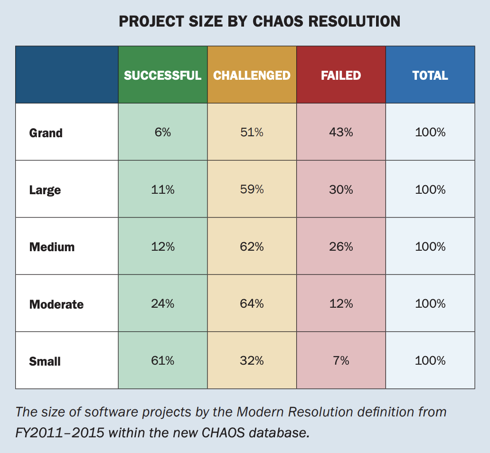

# ウォーターフォール全盛の組織で アジャイルを目指す 〜でかい計画に抗う編〜

**あかつか**

京アジャ
2024/10/25

---
## 自己紹介

- あかつか　赤塚啓紀
- 神戸でPHP書いています
  - 各地のPHPカンファレンスで登壇していたりします
  - PHPカンファレンス関西2025実行委員長
- アジャイルは実践し始めて日が浅いです

---
## 今日話したいこと

- アジャイルと出会って、救われた一人の人間の話

---
## アジャイルと出会ったきっかけ

- PHPカンファレンス北海道2024のトークを見て、 『エンジニアリング組織論への招待』を知って買ってみた
  - [新しくEMやってみる人にオススメしたい本を5分で25冊紹介する](https://speakerdeck.com/o0h/phpcondo-lt?slide=32)
- ちょうどこの頃、プロジェクトリーダーをやることが決まった
  - 20人月くらい（でかい）

---
## 当時の状況

- でかいプロジェクト
- でかいマイルストーン
- でかいチケット
 
### でかい〇〇が多すぎる！！

---
### でかいと言えば…
 

Chaos Report 2015. The Standish Group International, Inc.

---
## その結果
- チケットがでかいので、レビューが大変
- レビュー結果が返ってくる頃には内容を忘れている
- みんな、でかいチケットに着手しているので、そもそも誰もレビューできない
 
- マイルストーンの後期になって未レビューのチケットが大量に残っている状態
- でかいプロジェクトは失敗しやすい

---
## アジャイルと出会ってからやったこと①
- 自分がPLをやることになっていたプロジェクトで要素を取り入れ始めた
  - 週ごとに計画を見直す
    - 「計画に従うことよりも**変化への対応**を、」
  - 着手中のチケットがたまらないようにレビューとフィードバック修正を優先してもらう
  - 毎朝プロジェクトのタスクを共有してもらう
  - 週ごとに振り返りをする

---
## アジャイルと出会ってからやったこと②
- プロジェクトでサブ機能ごとに開発を進めて、結合してテストできる状態にした
  - 3つサブ機能があったので、順番に進めてできたものから受け入れテストをしてもらった

---
## アジャイルと出会ってからやったこと③
- アトラクタさんの研修に参加してCSMを取った
  - 箱根のオンサイトに参加
  - （自腹で行きました💸）

---
## アジャイルを実践し始めて生まれた変化

- **一つひとつ終わらせる**意識
- お互いがお互いの仕事に気を配れる
  - みんなでボールを運んでいく
- **レビュー待ちが減った**
 
- **「このプロジェクトはなんか楽しい」**
- リリース後のバグが減った

---
## アジャイルを実践してみてわかったこと

- プロジェクトベースで進む開発でも、アジャイルの考え方は十分に活用できる
- でかいマイルストーンでも、工程ごとに時間を区切るのではなく、機能ごとに時間を区切ると不確実性が抑えられる
- 年次で予算を立てないといけないのが難しさの原因
  - 計画を決めて予算を取れないとプロジェクトができない
  - 計画を決めないと工数をもらえないのは信用が足りないから
  - 成果を出して、信頼を勝ち取るという強い意志

---
## これから挑戦したいこと

- チームの自律を促せるようにしていきたい
- 組織全体に広げていく
- リリースがボトルネックになっているので、リリースフローを整える（進行中）
  - お客様への案内方法などCSも巻き込んで改善
- そもそも、不確実性の大きい「でかい」プロジェクトを作らせないような働きかけ

---
 
 

## まだまだ先は長いけれど、やっていき💪
## ご清聴ありがとうございました
## 懇親会でもお話ししましょう！！