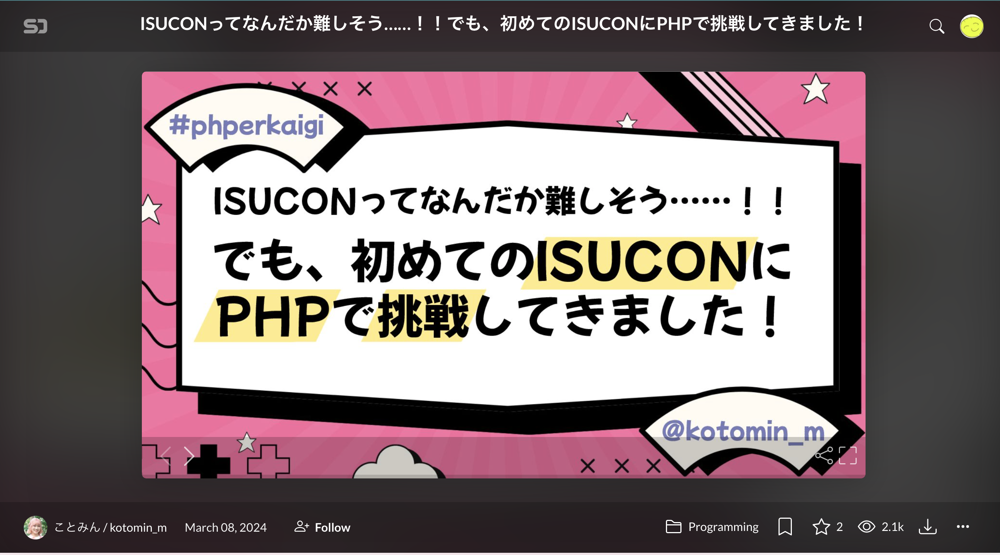
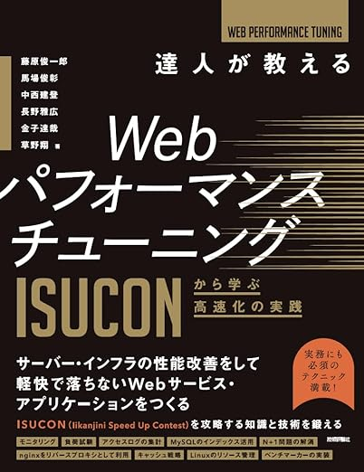

# PHPで ISUCON14に 初参加した！

**あかつか**

関西PHP勉強会
2024/12/12

---
## 自己紹介

- あかつか　赤塚啓紀
- 神戸でPHP書いています
  - 各地のPHPカンファレンスで登壇していたりします
  - PHPカンファレンス関西2025実行委員長

---
## おしながき

- ISUCONとは
- ISUCONに出てきた記録
- 準備したこと
- 当日できたこと
- ふりかえり
- Q&A

---
## ISUCONとは

- いい感じに(I)スピード(S)アップ(U)コンテストの略
- パフォーマンスチューニングの大会
  - 3人までのチームで参加する
  - 1000チームほど参加する大規模イベント
- 今年は12/8に開催された
- サンプル実装が各言語である（PHPもある）
  - 今年のPHP実装はhanhanさんとytakeさん（鬼感謝）

---
## きっかけ

---
## 準備したこと

---
## 準備したこと

- ISUCONの本を読んで手を動かしていった
  - DBにインデックスを貼ったり
  - Joinやキャッシュを使ってN+1を解消したり
  - 静的ファイルをWebサーバーから返すようにしたり
- 一番の学びは、チューニングの基本
  - 計測してボトルネックをとらえて、一つ一つ解決していく流れを体感できた

---
## 結果

- 関西のPHPer3人で参加してきた
- 最終スコア1001点
  - goの初期実装 820点
  - phpの初期実装 431点
  - （計測タイミングによってバラツキあり）
- 一応、意味のあることはできた？
---
## 振り返り

- ボトルネックがわかっても、実装がなかなかできない
  - ある程度慣れは必要
- アプリが正常に動作しなかったりすると失格になるが、それは免れた
  - 安全にチューニングをできた

---
## 反省

- 改善が遅く手数が出せなかった
- サーバーが3台あるが1台しか活用できなかった

---
## 学んだこと

- ボトルネックを特定してそこを直す
- ボトルネックの特定方法
  - 返すのに時間がかかっているリクエストを集計する
    - alp
  - 時間のかかるクエリを見つける
    - mysqldumpslow
    - pt-query-digest

---
## 感想

- アプリケーションがメインのエンジニアだと普段あまり触らないインフラの知識がつけられてよかった
- 負荷テストの考え方がわかった
  - ISUCONに出るつもりがなくてもISUCON本はおすすめ
- 申し込みさえすればチームは何とかなる
  - コミュニティーを使ってくれよな！

--- 
## Q&A

なんでもきいてください！

- 今回どんな問題だったの？
- 練習始めるにあたって知っておくべきことある？

---
## 参考資料

- https://fortee.jp/phperkaigi-2024/proposal/f898ae2c-f4ae-42f5-bdad-2f74d9c53872

---

## みんなも来年はISUCONに出よう！
### PHPででも、そうでなくても
 
 
 

### おわり