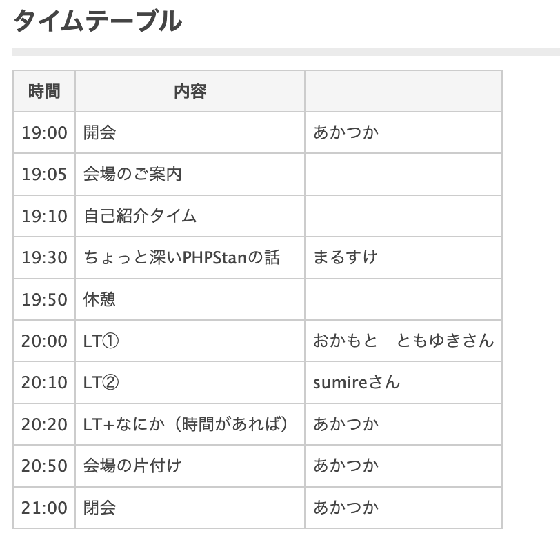

# 関西PHP勉強会 オープニング

**あかつか**

関西PHP勉強会
2025/1/16

---
## この会について

- 関西のPHPエンジニアが情報共有や交流のために集まるイベントです
- トークをしたり、聴いたり、雑談したりして盛り上がりましょう

---
## ハッシュタグ

- `#phpkansai` `#ashibinaa`
- 是非セットで！

---

---
## 主催者の自己紹介

- あかつか　赤塚啓紀
- 神戸でPHP書いています
  - 各地のPHPカンファレンスでスタッフしたり 登壇していたりします
  - **PHPカンファレンス関西2025実行委員長**

---
## 突然の宣伝

- PHPカンファレンス関西2025を来年7月に開催します
  - コアスタッフを募集しています（明日まで！）
  - 説明会のアーカイブをYouTubeに公開中です

---
## 本編開始です

- 一旦会場のご紹介をどりぃさんにお繋ぎします！
